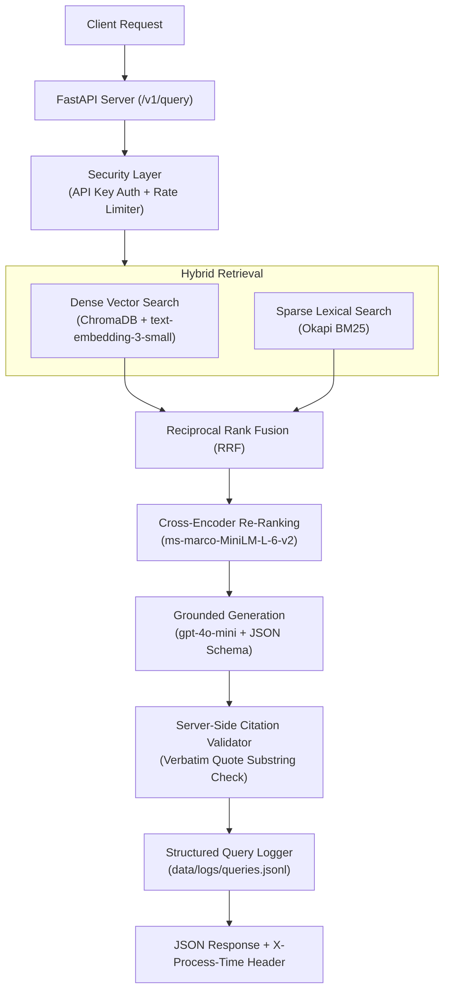

# Production-Grade Grounded RAG API

A production-ready, enterprise-grade Retrieval-Augmented Generation (RAG) system built with **FastAPI**, **ChromaDB**, **BM25**, **Reciprocal Rank Fusion (RRF)**, **Cross-Encoder Re-ranking**, and **OpenAI Structured Generation**.

Unlike basic AI wrappers, this system is engineered for **precision, zero-hallucination compliance, server-side citation validation, rate limiting, and incremental indexing**.

---

## 🌟 Key Features

* **⚡ Incremental Ingestion Engine (`src/ingestion/`):** Parses PDFs, DOCX, Markdown, and TXT files. Uses SHA-256 manifest hashing to skip unchanged files and perform $\mathcal{O}(1)$ delta indexing.
* **🔎 Multi-Stage Hybrid Retrieval (`src/retrieval/`):** Combines **Dense Vector Search** (ChromaDB + OpenAI `text-embedding-3-small`) with **Sparse Keyword Search** (Okapi BM25) to capture both semantic meaning and exact term matches.
* **🔀 Reciprocal Rank Fusion (RRF) (`src/retrieval/rrf.py`):** Merges dense and sparse ranking lists into an optimal fused candidate set.
* **🧠 Cross-Encoder Re-ranking (`src/rerank/`):** Utilizes `cross-encoder/ms-marco-MiniLM-L-6-v2` for joint cross-attention scoring over top fused candidates before feeding context to the LLM.
* **🛡️ Zero-Trust Grounded Generation (`src/generation/`):** Enforces strict JSON schemas (`gpt-4o-mini`) and **verifies all citations server-side** against raw document text to catch and block hallucinations.
* **🔒 Production API & Security (`src/api/`):** Built-in constant-time API key auth (`secrets.compare_digest`), sliding-window rate limiting, origin boundary CORS control, and boot-time model pre-loading.
* **📊 Observability & Evaluation (`src/observability/`, `eval/`):** JSON-line structured query telemetry, execution timing, and an automated 19-question evaluation harness calculating Hit Rate, MRR, and Faithfulness.

---

## 🏗️ System Architecture



---

## 🚀 Quick Start

### 1. Prerequisites
* Python 3.11+
* OpenAI API Key

### 2. Installation
Clone the repository and set up a virtual environment:

```bash
git clone https://github.com/fawasam/rag-production.git
cd rag-production

python3 -m venv .venv
source .venv/bin/activate
pip install -r requirements.txt
```

### 3. Environment Configuration
Copy the example environment file and add your `OPENAI_API_KEY`:

```bash
cp .env.example .env
```

Edit `.env`:
```env
OPENAI_API_KEY=sk-your-openai-api-key
API_KEYS=dev-key-change-me
RATE_LIMIT_PER_MINUTE=30
CORS_ALLOWED_ORIGINS=
```

---

## 📂 Document Ingestion

Place your raw source files (`.pdf`, `.docx`, `.md`, `.txt`) into `data/raw/` and run the incremental indexer:

```bash
python -m src.ingestion.index
```

* *Note: Subsequent runs will automatically hash input files and skip re-embedding unchanged documents.*

---

## 🌐 Running the API

Start the FastAPI development server with uvicorn:

```bash
uvicorn src.api.main:app --reload
```

The server will pre-load the Cross-Encoder model on startup and listen on `http://127.0.0.1:8000`.

* **Interactive Swagger Documentation:** Open [http://127.0.0.1:8000/docs](http://127.0.0.1:8000/docs) in your browser.

---

## 📡 API Usage

### Query Endpoint (`POST /v1/query`)

```bash
curl -X POST "http://127.0.0.1:8000/v1/query" \
  -H "Content-Type: application/json" \
  -H "X-API-Key: dev-key-change-me" \
  -d '{
    "query": "What machine learning model was used for lung cancer detection?",
    "top_k": 5
  }'
```

### Example Response
```json
{
  "answer": "The study evaluated VGG16 and custom CNN architectures for lung cancer detection from CT scan images, with VGG16 achieving a test accuracy of 98.18%.",
  "answerable": true,
  "citations_valid": true,
  "citations": [
    {
      "chunk_id": "AI-Powered Lung Cancer Detection.pdf::chunk_4",
      "supporting_quote": "VGG16 achieved a high test accuracy of 98.18%"
    }
  ],
  "retrieved_chunk_ids": [
    "AI-Powered Lung Cancer Detection.pdf::chunk_4",
    "Deep learning-based approach.pdf::chunk_12"
  ],
  "debug": {
    "dense": ["AI-Powered Lung Cancer Detection.pdf::chunk_4"],
    "bm25": ["AI-Powered Lung Cancer Detection.pdf::chunk_4"],
    "fused": ["AI-Powered Lung Cancer Detection.pdf::chunk_4"],
    "reranked": ["AI-Powered Lung Cancer Detection.pdf::chunk_4"],
    "invalid_citations": []
  }
}
```

---

## 🐳 Docker Deployment

The application is containerized with a non-root user setup (`appuser`) and automated initial ingestion.

```bash
docker compose up -d --build
```

---

## 🧪 Testing & Evaluation

### Run Unit Tests
```bash
pytest
```

### Run Benchmark Evaluation Harness
Evaluate Hit Rate, MRR, and Citation Accuracy against the 19-question golden test suite:

```bash
python -m eval.run_eval
```

---

## 📖 Deep-Dive Architecture Guide

For a detailed walkthrough of all 5 system modules explained from both a **Student perspective** (analogies & concepts) and a **CTO perspective** (engineering trade-offs & security matrices), see:

👉 [**`docs/ARCHITECTURE_EXPLAINED.md`**](docs/ARCHITECTURE_EXPLAINED.md)

---

## 📁 Repository Structure

```text
rag-production/
├── README.md                   # Project documentation
├── Dockerfile                  # Non-root Docker container spec
├── docker-compose.yml          # Docker Compose service definition
├── requirements.txt            # Python dependencies
├── data/
│   ├── raw/                    # Raw input documents (.pdf, .docx, .md, .txt)
│   ├── processed/              # Persistent ChromaDB & manifest index files
│   └── logs/                   # JSON-line query execution telemetry
├── docs/
│   ├── ARCHITECTURE_EXPLAINED.md # Full 5-module technical deep dive
│   ├── GETTING_STARTED.md      # Detailed setup guide
│   └── SRS.md                  # Software Requirements Specification
├── eval/                       # Golden dataset & benchmark eval scripts
├── src/
│   ├── api/                    # FastAPI endpoints, auth, and rate limiting
│   ├── generation/             # Schema enforcement & citation validator
│   ├── ingestion/              # Parsers, chunker & incremental indexer
│   ├── observability/          # Timer & JSON query logging
│   ├── rerank/                 # Cross-encoder neural reranker
│   └── retrieval/              # Dense, BM25, and RRF retrieval logic
└── tests/                      # Automated test suite
```

---

## 📜 License

MIT License. Built for production AI application standards.
